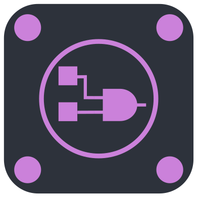
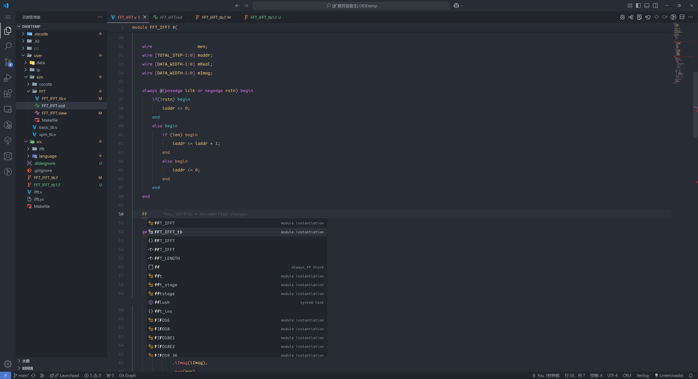
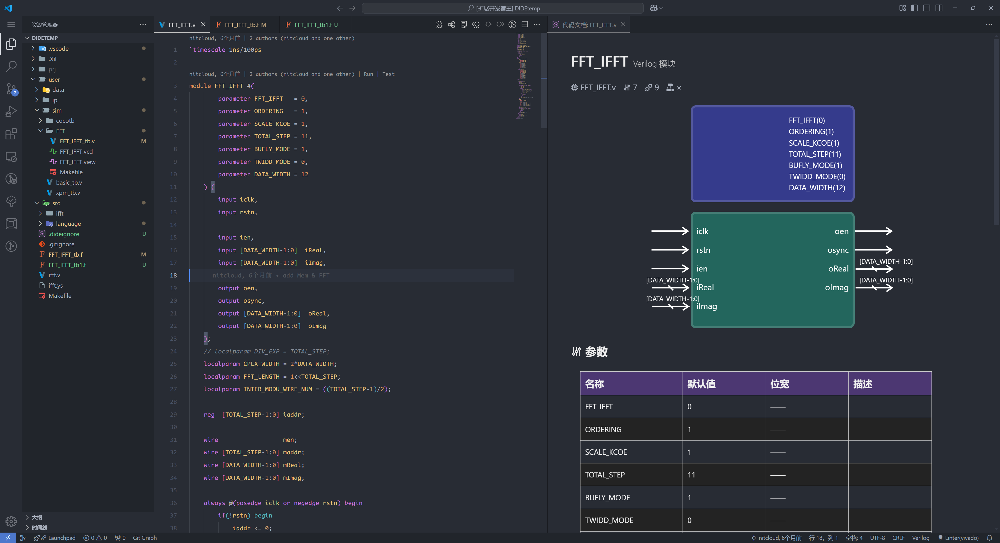
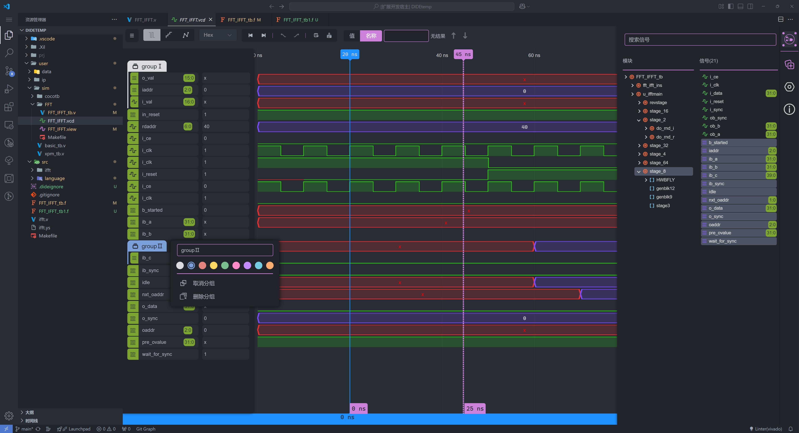

## <code>Digital IDE</code> | All in one <code>vscode</code> plugin for Verilog/VHDL development

[Document (New)](https://sterben.nitcloud.cn/) | [中文文档 (New)](https://sterben.nitcloud.cn/zh/) | [Bilibili Video](https://www.bilibili.com/video/BV1t14y1179V/?spm_id_from=333.999.0.0)

## 0.4.0 新增内容

**使用 Rust 重写全新的解析器与语言服务**：支持 verilog, vhdl, system verilog，性能更快，服务更加稳定。

**修缮内容的文档化**：提供更加直接快速的，关于当前 HDL 文件的基本信息和依赖信息。支持 wavedrom 风格的注释并支持将其渲染成可视化的图表。

**新增内容的 Vcd 渲染器**：增加顶部工具栏、系统信标等组件；支持左侧面板选定信号的拖拽、分组等功能、支持按住 shift 连续选中一片信号并进行增加和删除操作；支持基于系统信标建立相对坐标系；顶部工具栏支持选中信号的显示数字的进制转换，渲染模态切换，支持将信号渲染为模拟量。

- 全新的 Netlist 渲染器

## Feature
- 增加对于 vhdl 的 全面支持（文件树、LSP等）
- 增加 verilog, vhdl, xdc, tcl, vvp, vcd 等语言或生成文件的工作区图标
- 增加对于 vivado, modelsim, verilator 的支持，用户可以通过设置 `function.lsp.linter.vhdl.diagnostor`(设置 vhdl) 和 `function.lsp.linter.vlog.diagnostor`(设置 verilog) 来使用这些第三方工具的仿真和自动纠错。
- 增加对于 TCL, XDC, VVP 等脚本的 LSP 和 语法高亮 支持。

## Change
- 将插件的工作状态显示在 vscode 下侧的状态栏上，利于用户了解目前的设置状态
- 状态栏右下角现在可以看到目前选择的linter以及是否正常工作了
- 优化项目配置目录
- 优化自动补全的性能

## Bug 修复
- 修复文档化 input, output 处注释无法正常显示到文档的 bug
- 修复 iverilog 仿真功能中，将重复的路径作为编译参数编译的 bug
- 修复 iverilog 仿真功能中，将 <code>`include</code> 加入或去除后，无法通过仿真编译的 bug （没有更新 instance 的 instModPathStatus 属性）
- 修复其他已知 bug
