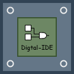

# Digital IDE - version 0.3.0

> ASIC & FPGA develop Platform on VS code (IDE for development of verilog, vhdl and system verilog)

- If you have any questions, please post them under [issues](https://github.com/Bestduan/Digital-IDE/issues).
- If you like it, please [star](https://github.com/Bestduan/Digital-IDE).

[English](https://bestduan.github.io/Digital-IDE-doc/#/)

[中文教程](https://digital-eda.github.io/DIDE-doc-Cn/#/)

You are free to use it. Finally, if you like this extension and have some great idea, please connact with me. I am look foward to your joining.

- Email: sterben.661214@gmail.com.
- QQ群: 932987873

--------------------------------------------------------------------------------------------

## Thanks

* [VHDL](https://github.com/puorc/awesome-vhdl)
* [TerosHDL](https://github.com/TerosTechnology/vscode-terosHDL)
* [TCL Language Support](https://github.com/go2sh/tcl-language-support)
* [Verilog HDL/SystemVerilog](https://github.com/mshr-h/vscode-verilog-hdl-support)
* [SystemVerilog - Language Support](https://github.com/eirikpre/VSCode-SystemVerilog)