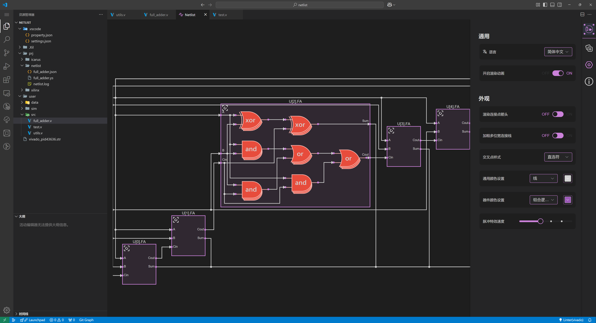

## <code>Digital IDE</code> | All in one <code>vscode</code> plugin for Verilog/VHDL development

[Document (New)](https://nc-ai.cn/) | [中文文档 (New)](https://nc-ai.cn/zh/) | [Bilibili Video](https://www.bilibili.com/video/BV1t14y1179V/?spm_id_from=333.999.0.0)

## New in 0.4.0

**Rewritten Parser and Language Services in Rust**: Supports Verilog, VHDL, and SystemVerilog with faster performance and more stable services.

**Improved Documentation**: Provides more direct and faster access to basic information and dependencies of the current HDL file. Supports Wavedrom-style comments and renders them into visual diagrams.

**New VCD Renderer**: Added top toolbar, system beacon, and other components; supports drag-and-drop and grouping of selected signals in the left panel, as well as selecting multiple signals by holding Shift for addition and deletion; supports establishing a relative coordinate system based on system beacons; the top toolbar supports base conversion for displayed numbers of selected signals, rendering mode switching, and rendering signals as analog values.

- Brand New Netlist Renderer

## Features
- Added comprehensive support for VHDL (file tree, LSP, etc.)
- Added workspace icons for languages or generated files such as Verilog, VHDL, XDC, TCL, VVP, VCD, etc.
- Added support for Vivado, ModelSim, and Verilator. Users can use these third-party tools for simulation and auto-correction by setting `function.lsp.linter.vhdl.diagnostor` (for VHDL) and `function.lsp.linter.vlog.diagnostor` (for Verilog).
- Added LSP and syntax highlighting support for scripts like TCL, XDC, and VVP.

## Changes
- Display the plugin's working status in the status bar at the bottom of VSCode, making it easier for users to understand the current settings.
- The bottom-right corner of the status bar now shows the currently selected linter and whether it is functioning properly.
- Optimized project configuration directory.
- Improved auto-completion performance.

## Bug Fixes
- Fixed a bug where comments on `input` and `output` were not displayed correctly in the documentation.
- Fixed a bug in the Icarus Verilog simulation feature where duplicate paths were included as compilation parameters.
- Fixed a bug in the Icarus Verilog simulation feature where adding or removing <code>include</code> would cause simulation compilation to fail (the `instModPathStatus` property of the instance was not updated).
- Fixed other known bugs.
